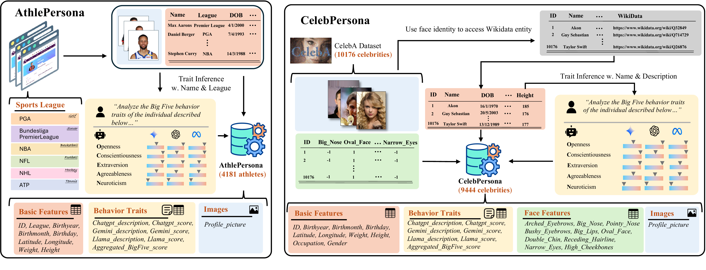

# [ICLR 2026] PersonaX: Multimodal Datasets with LLM-Inferred Behavior Traits

This is the official implementation of the paper **"[PersonaX: Multimodal Datasets with LLM-Inferred Behavior Traits](https://openreview.net/pdf?id=x446ASYlCt)"**, ICLR 2026.

# Datasets

The dataset is available in HuggingFace: [AthlePersona](https://huggingface.co/datasets/Persona-X/athlepersona), [CelebPersona](https://huggingface.co/datasets/Persona-X/celebpersona)

Please refer to the [Usage Guidelines](USAGE_GUIDELINES.md) before using the datasets.

# Overview



Understanding human behavior traits is central to applications in human-computer interaction, computational social science, and personalized AI systems. Such understanding often requires integrating multiple modalities to capture nuanced patterns and relationships. However, existing resources rarely provide datasets that combine behavioral descriptors with complementary modalities such as facial attributes and biographical information. To address this gap, we present PersonaX, a curated collection of multimodal datasets designed to enable comprehensive analysis of public traits across modalities. PersonaX consists of (1) CelebPersona, featuring 9444 public figures from diverse occupations, and (2) AthlePersona, covering 4181 professional athletes across 7 major sports leagues. Each dataset includes behavioral trait assessments inferred by three high-performing large language models, alongside facial imagery and structured biographical features.

We analyze PersonaX at two complementary levels. First, we abstract high-level trait scores from text descriptions and apply five statistical independence tests to examine their relationships with other modalities. Second, we introduce a novel causal representation learning (CRL) framework tailored to multimodal and multi-measurement data, providing theoretical identifiability guarantees. Experiments on both synthetic and real-world data demonstrate the effectiveness of our approach.
By unifying structured and unstructured analysis, PersonaX establishes a foundation for studying LLM-inferred behavioral traits in conjunction with visual and biographical attributes, advancing multimodal trait analysis and causal reasoning.

# Code Structure

The code is organized into the following three main components:

1. **Independence Testing**This folder contains the code used to do CIT tests on various data.
2. **Synthetic Experiment**This folder contains the code used to carry out synthetic experiment with MNIST datasets.

   **Mnist**

   ```bash
   1. python run_mnist_3measurement.py --ground_truth --seed {seed}
   ```
3. **Real-World Experiment**
   This folder contains the code used to carry out real-world experiment and infer the causal graph.

   **Celeb**

   ```bash
   1. python run_celeb_3measurement.py --ground_truth --seed {seed}
   2. python draw.py
   ```

   **Athle**

   ```bash
   1. python run_athlete_3measurement.py --ground_truth --seed {seed}
   2. python draw.py
   ```


If you find it helpful, please consider citing:

```
@article{li2026personax,
  title={PersonaX: Multimodal Datasets with LLM-Inferred Behavior Traits},
  author={Li, Loka and Kang, Wong Yu and Fu, Minghao and Chen, Guangyi and Chen, Zhenhao and Luo, Gongxu and Sun, Yuewen and Khan, Salman and Spirtes, Peter and Zhang, Kun},
  journal={International Conference on Learning Representations},
  year={2026}
}
```
